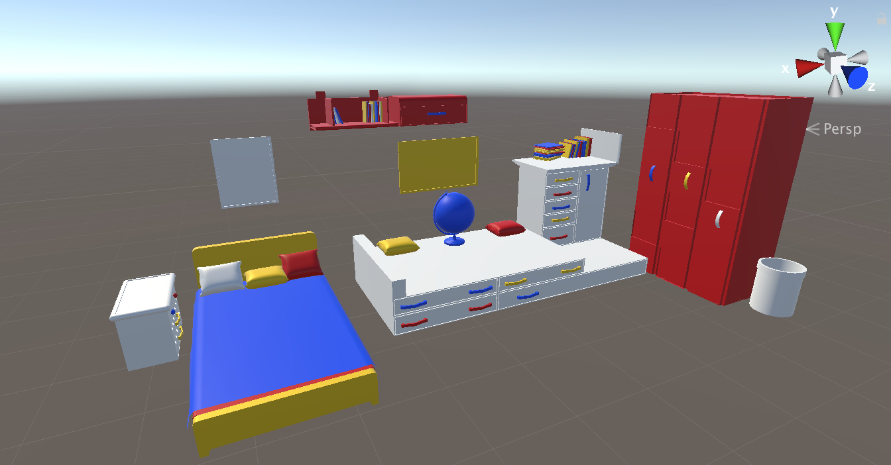

# VRProject-lmartinusic
### Project description: 
You have to collect all the stuff thats given and hidden in the scene and put it in a basket in the scene. Collect all the stuff and win the game!
### Development platform:
- macOS Catalina Version 10.15.3 
- Unity Version: 2019.1.14f1
- Visual Studio Code Version: 1.30.2
- Scripting Runtime Version: .NET 4.x Equivalent
- API Compatibility Level: .NET 2.0

### Target platform:
Oculus Rift

### Visuals:
* Intermediate result 

### Necessary setup/execution steps: 

### Third party material:
<li>Globe https://assetstore.unity.com/packages/3d/props/interior/school-globe-152072</li>
<li>Room https://free3d.com/3d-model/kids-room-interior-73776.html </li>

### Project state: 
60 %

Link to Planner: https://tasks.office.com/htl-salzburg.ac.at/Home/PlanViews/dpPkrmPPyUG1WAz11AoOIpYABqT0?Type=PlanLink&Channel=Link&CreatedTime=637209390343130000

### Limitations: 
none

### Lessons Learned: 
- my none existend skills in Unity and programming

Copyright by Leo Martinusic :)
